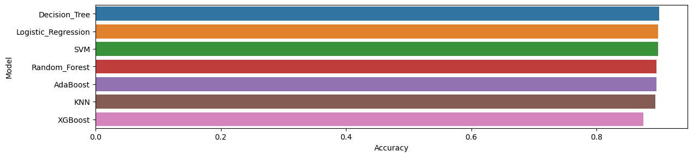
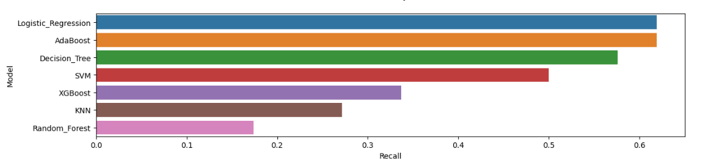
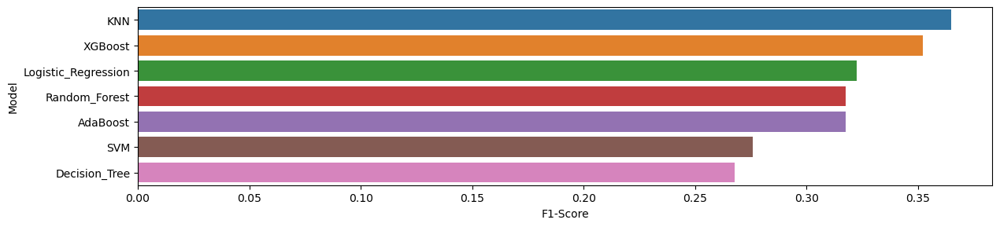

# General Comparison of Popular Supervised ML Models 

The data is taken from (https://www.kaggle.com/datasets/sahistapatel96/bankadditionalfullcsv)

### The step of the Analyzes:

1. **Data Cleaning**   
This step involves handling missing values, removing duplicates, and correcting inconsistent data to ensure a high-quality dataset. Clean data is crucial for accurate model training and evaluation
2. **Visualizing**  
In this phase, data is explored through plots and charts to understand distributions, relationships, and potential outliers. Visualization helps guide feature selection and model choice.
3. **Training**  
Machine learning models are trained using the prepared dataset. Different algorithms are applied to learn patterns and relationships in the data.
4. **Prediction**  
The trained models are used to make predictions on unseen test data. Model performance is evaluated based on these predictions.
5. **Comparison**  
The results of different models are compared using metrics such as accuracy, recall and F1-score. The best-performing model is selected based on these evaluations.

### Results

   
    
