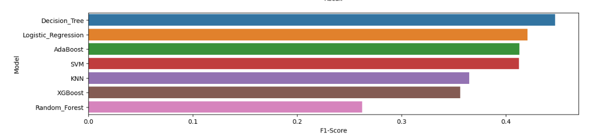

# 📊 Comparative Analysis of Popular Supervised Machine Learning Models

This project provides a structured comparison of widely used supervised machine learning algorithms. It demonstrates the end-to-end pipeline of data preprocessing, visualization, model training, and evaluation—serving as a solid portfolio project for showcasing core data science skills.

> 📂 Dataset Source: [Bank Marketing Dataset - Kaggle](https://www.kaggle.com/datasets/sahistapatel96/bankadditionalfullcsv)

---

## 🧭 Project Workflow

### 1. 🔍 Data Cleaning  
- Handled missing values, removed duplicates, and standardized inconsistent entries.  
- Ensured high-quality input for accurate model training.

### 2. 📊 Data Visualization  
- Used charts and graphs to analyze feature distributions, relationships, and outliers.  
- Helped inform feature engineering and algorithm selection.

### 3. 🧠 Model Training  
- Trained multiple machine learning models using the cleaned dataset.  
- Algorithms include logistic regression, decision trees, random forests, and more.

### 4. 🔮 Prediction  
- Applied trained models on unseen test data.  
- Evaluated predictions using relevant performance metrics.

### 5. ⚖️ Model Comparison  
- Compared model performances using **accuracy**, **recall**, and **F1-score**.  
- Identified the most effective model based on objective metrics.

---

## 🏁 Results

Below is a visual summary of the model comparison:

---

## 🧰 Tools & Libraries Used

- Python 3.x
- pandas, numpy
- matplotlib, seaborn
- scikit-learn (Logistic Regression, Decision Tree, Random Forest, etc.)

---

## 📌 Key Takeaways

- Demonstrates a complete supervised ML pipeline
- Emphasizes the importance of preprocessing and visualization
- Highlights differences in algorithm performance on real-world data

   
    
